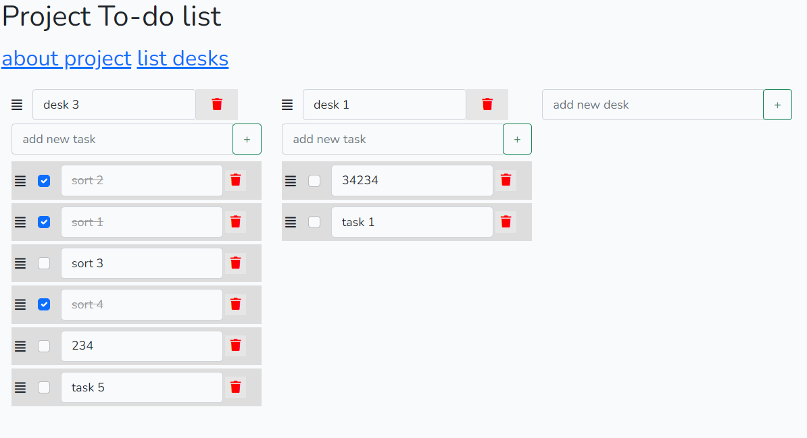

# Laravel TodoList with vue components

## install project with docker:

for install composer dependencies use next command:

    docker run --rm \ 
    -u "$(id -u):$(id -g)" \ 
    -v $(pwd):/var/www/html \
    -w /var/www/html \
    laravelsail/php81-composer:latest \
    composer install --ignore-platform-reqs

read more here:
https://laravel.com/docs/8.x/sail#installing-composer-dependencies-for-existing-projects
    
    cp .env.example .env  
    alias sail='[ -f sail ] && bash sail || bash vendor/bin/sail'
    sail up
    sail artisan migrate
    sail artisan key:generate
